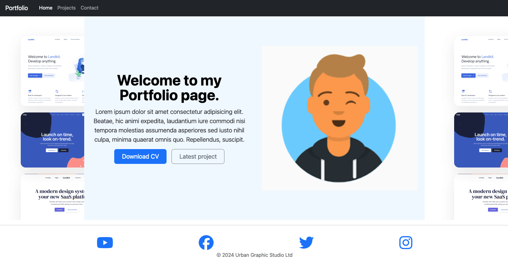
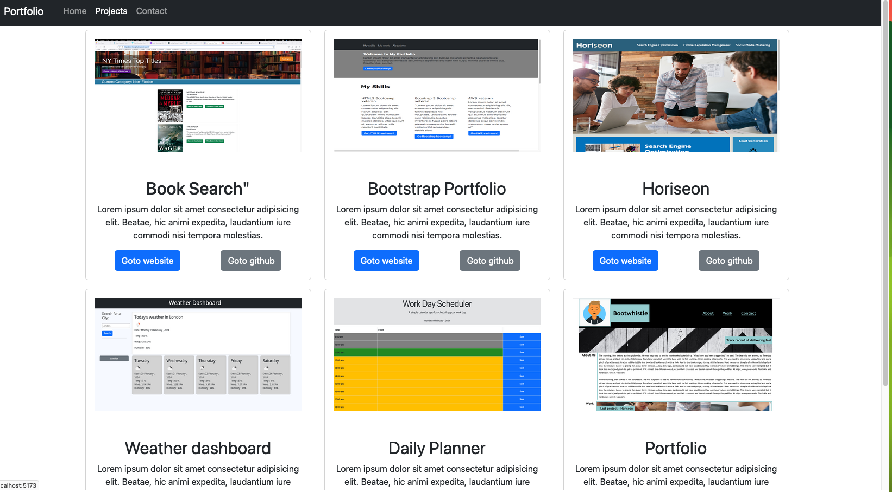
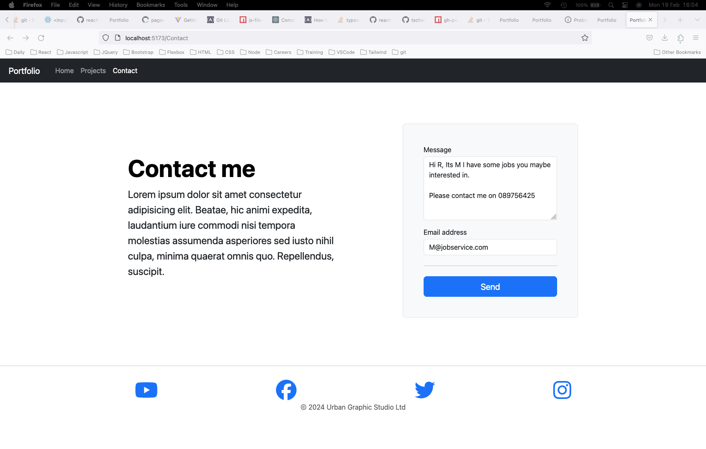
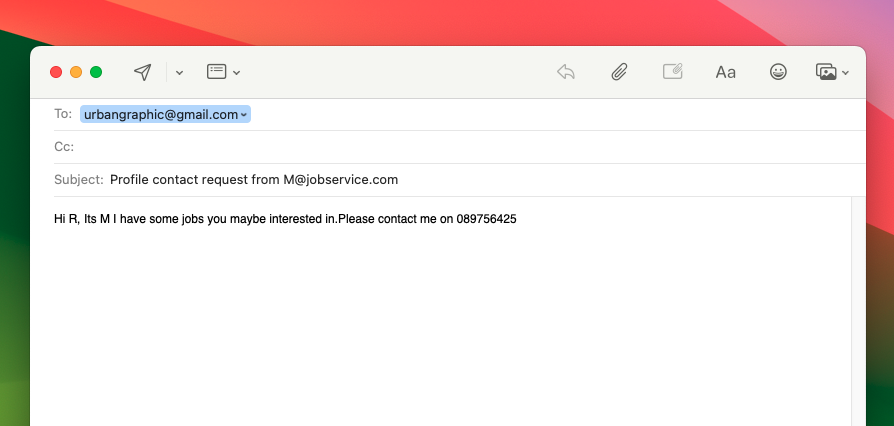

# React-Portfolio

## Background

A portfollio is to to be created using react and bootstrap 5.

This portfolio is a work in progress and therefore the data used is fake.

## User Story

```
As a Hiring Manager I need links to portfolios
so that I can review them with clients on suitable candidates that meet their needs. 
```

## Wireframe

No wireframe was provided but an example of the landing page design was provided


### Base Requirements

* Technologies that must be used:
  * [ ] React
  * [ ] Navigation with `React Router`, dynamic rendering, or another third part router
* Your portfolio the following information:
  * [ ] Your name
  * [ ] Links to your:
    * [ ] GitHub Profile
    * [ ] LinkedIn Page
    * [ ] Email Address
    * [ ] Phone Number - (optional)
    * [ ] PDF version of your resume
      * Your resume contain up-to-date projects and professional experience
    * [ ] A list of projects (Challenges or Projects). For each project, make sure you have the following:
      * [ ] Project title
      * [ ] Link to the deployed version
      * [ ] Link to the GitHub repository
      * [ ] GIF or screenshot of the deployed application

## Deliverable:

Follow the link to view the boostrap-portfolio landing page:

[https://pine-box.github.io/react-folio/](https://pine-box.github.io/react-folio/)

# Home Page

On the hompage clicking on the download cv will download a fake cv.

Clicking on Latest project will open the website of the latest project.



# Project Page

On the project page you see the gallery of projects that I have done. Clicking on goto website will take open a new tab with that project landing page open.

Clicking on goto github will open a new tab with the github readme open.



# Contact Page


Contact Page Details

Validation is on empty message or email address and also if the email address pattern is invalid.

On clicking send, your email client app will open and with the entered email address and message captured in the subject and body of the email.





